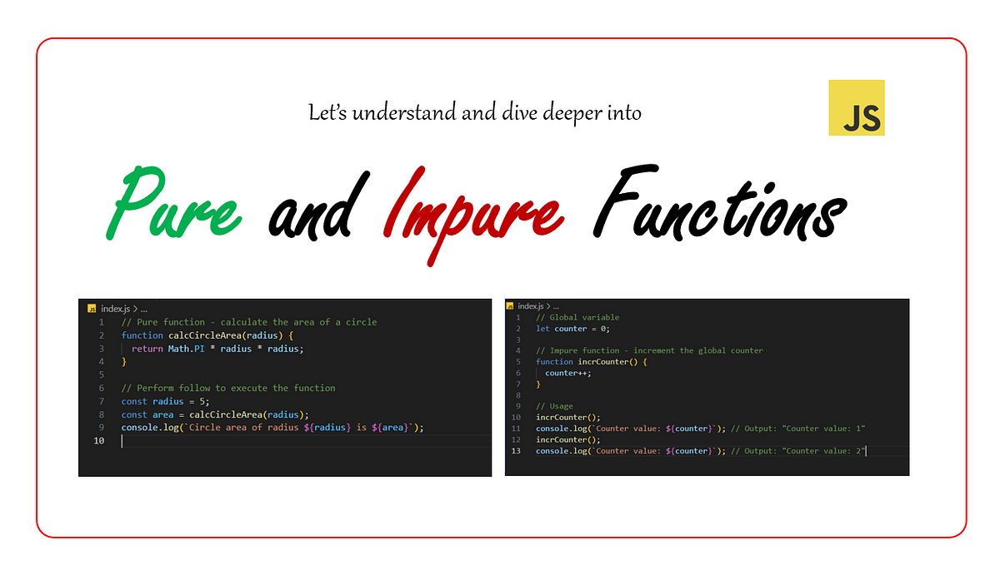
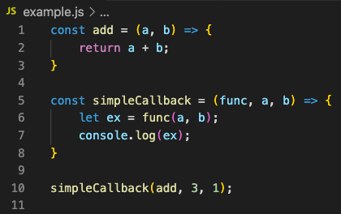
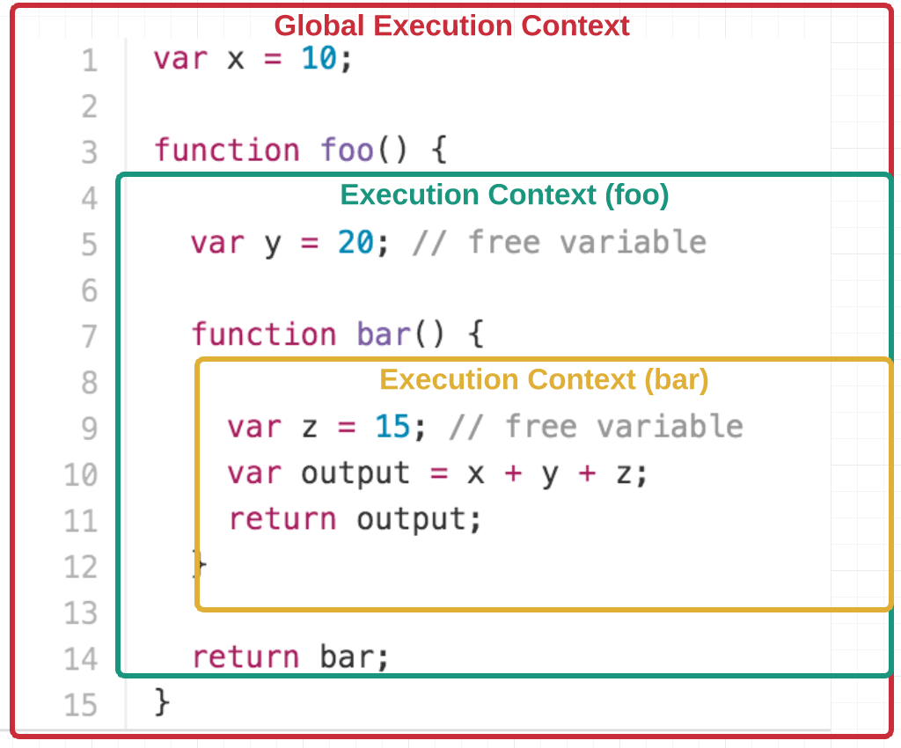
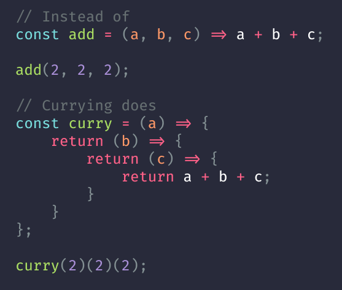
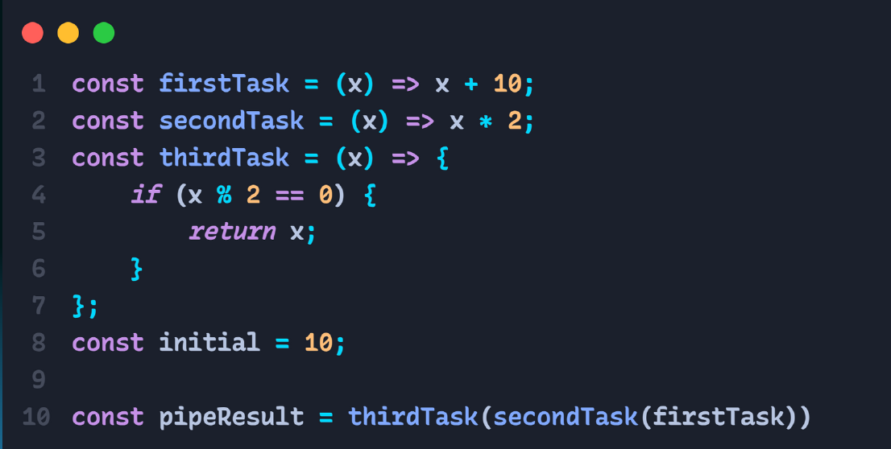
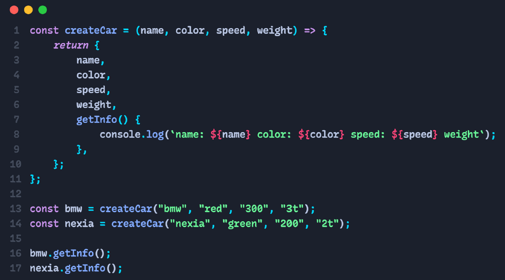
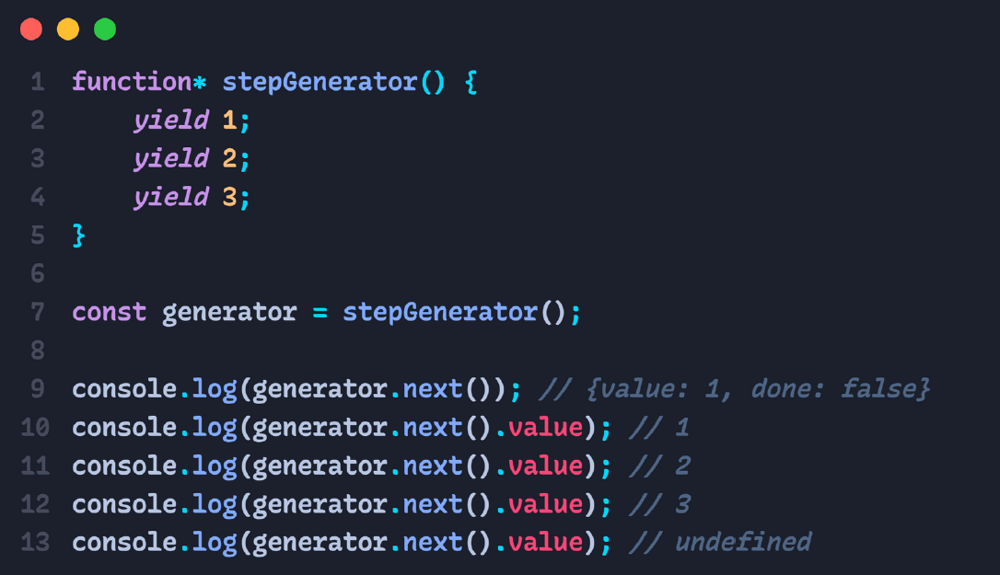

# Homework

### Object

- Object - bir nechta ma'lumotlar to'plamini o'zida saqlovchi ma'lumot turi (Data-Type).Objekt figurali qavslar yordamida yaratiladi.

Object literal syntax:
```
const person {
    name: "Jahongir";
    age: 18;
}
console.log(talaba);

```

Class instance:

```
const person = new Object({
    name: "Jahongir";
    age: 18;
})
console.log(person);

```

Objectga tashqaridan ma'lumot qo'shish quyidagicha bo'ladi:

```
const person {
    name: "Jahongir";
}

person.age = 18;

```

Objectdagi ma'lumotni tashqaridan o'chirish quyidagiicha bo'ladi:

```
const person {
    name: "Jahongir";
    age: 18;
}
delate person.age;

```
---

### Function types, HOF

#### 1. Pure / impure


#### 2. Callback


#### 3. Closure


#### 4. Currying


#### 5. Pipe


#### 6. Factory


#### 7. Generator
~